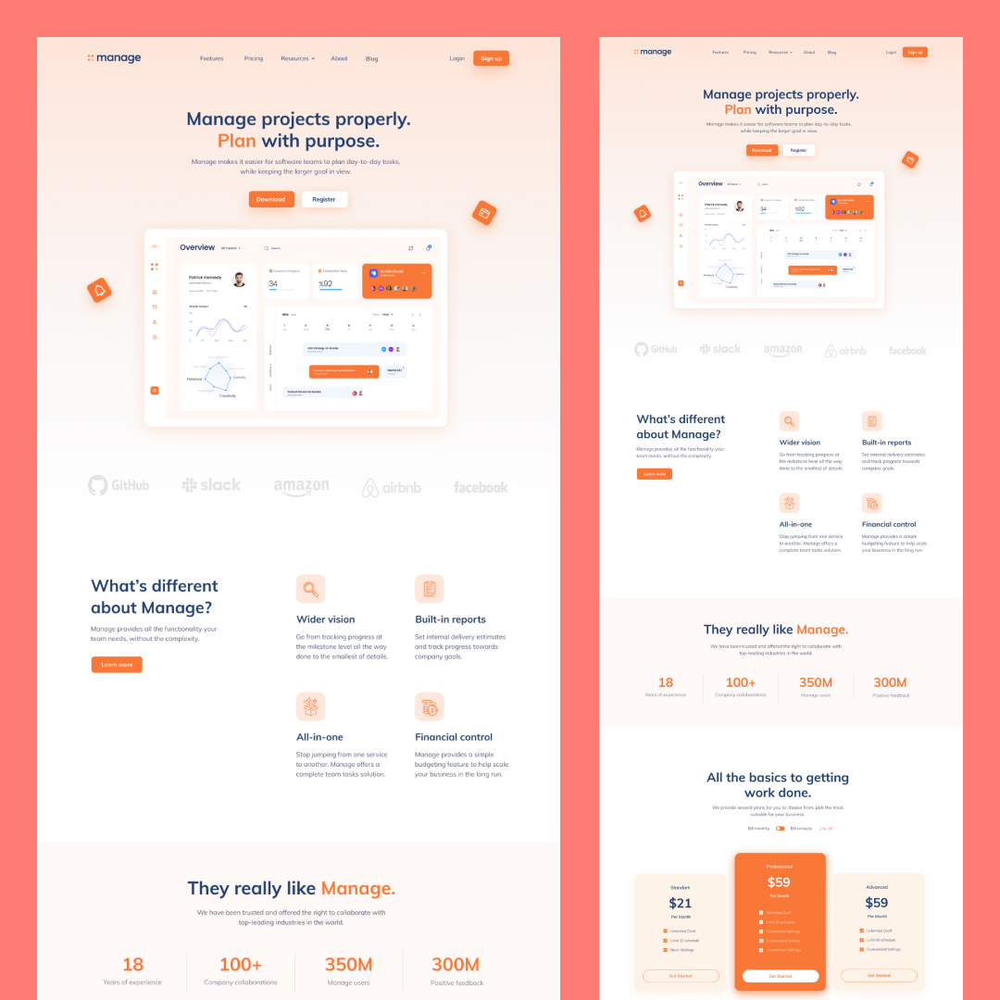

# Manage - Featuring Next.js, GraphCMS and TailwindCSS

## The Challenge⚡️

I designed this landing page and wanted to build using new technologies that I've never tried before. 

So I went with tailwind for styling, as a developer who uses scss as a tool of choice for styles, I was highly amazed by how tailwind speeds things up. 

Here was the challenge:

- View the optimal layout for each page depending on the device's screen size
- Providing all the content from GraphCMS (images, titles, descriptions etc.)
- Implementing a working testimonial slider on all screen sizes
- Beautiful scroll, javascript & css animations

## Built With ✨

- Tailwind CSS for styling
- Apollo-client and GraphQL
- GraphCMS - Headless CMS
- [React](https://reactjs.org/) - JS library
- [Next.js](https://nextjs.org/) - React framework
- Typescript
- AOS - animation library

**Thanks for sharing** 🚀
